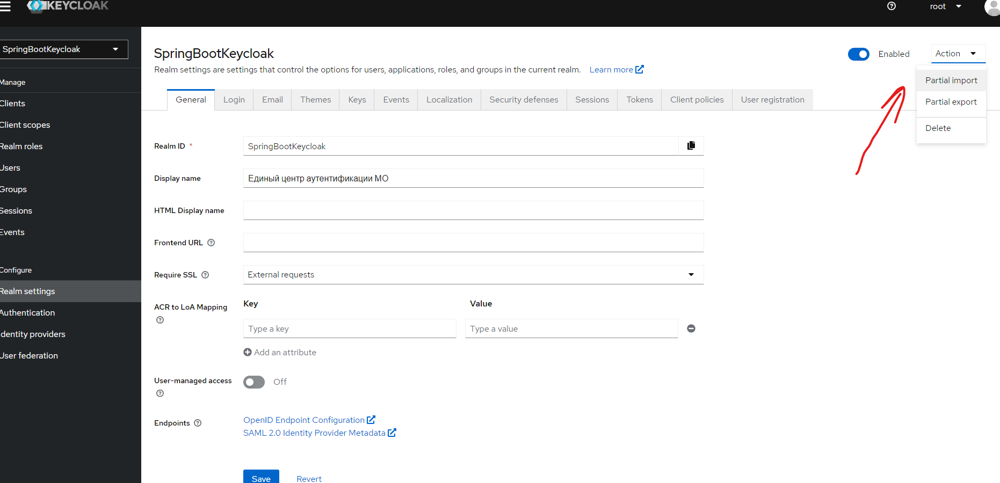

## Установка Keycloak Windows

1. Скачиваем архив: https://www.keycloak.org/downloads
2. Переписываем содержимое архива например в папку: c:\Program Files\keycloak
3. Добавляем в "переменные среды" path: c:\Program Files\keycloak\bin
4. Запускаем в консоли с авторскими правами: kc.bat start-dev
5. По умолчанию сервер запускается на порту 8080
6. Переопределить порт например на 8180: kc.bat start-dev --http-port=8180
7. Проект настроен именно на порт 8180 для Keycloak

## Настраиваем Keycloak realm

1. Создаем realm с названием: SpringBootKeycloak
2. Создаем клиента с названием: login-app
3. Оставляем метод авторизации по умолчанию.
4. Поле "Valid redirect URIs" прописываем 2 адреса:
5. http://localhost:8080/*
6. http://localhost:8084/*
7. Создаем пользователей, для проверки любые сойдут
8. ЕСТЬ ФАЙЛ ИМПОРТА - лежит в корне проекта: [realm-export.json](realm-export.json)
9. Его можно импортировать отсюда (ненужные realms можно удалить):
 

 
10. И тогда не нужно выполнять пункты 1-7 

## Собираем м запускаем

1. В проекте 2 модуля
2. [service_8080](service_8080)
3. [service_8084](service_8084)
4. Запускаем оба модуля (одновременно или поочереди как хотите)
5. Для чистоты эксперимента открываем новое окно браузера "инкогнито"
6. Когда оба модуля запустились, переходим по любому из 2х адресов:
7. http://localhost:8080
8. http://localhost:8084 - на оба сразу забегать не нужно :)
9. Попадаем на аутентификацию, проходим ее с вашим логином и паролем пользователя, который создавали в keycloack (если делали это сами а не воспользовались import-ом)
10. А если realm был импортирован, то там есть 2 пользователя:
11. логин:alex, пароль:alex
12. логин:admin пароль:admin
13. После аутентификации вы попадаете на главную тестовую страницу, там есть 2 ссылки, по ним вы можете пройти в модуль 1 или модуль 2, которые по сути 2 разных приложения, работают на портах 8080 и 8084, но должны предоставлять пользователям доступ по единому логину и паролю.

